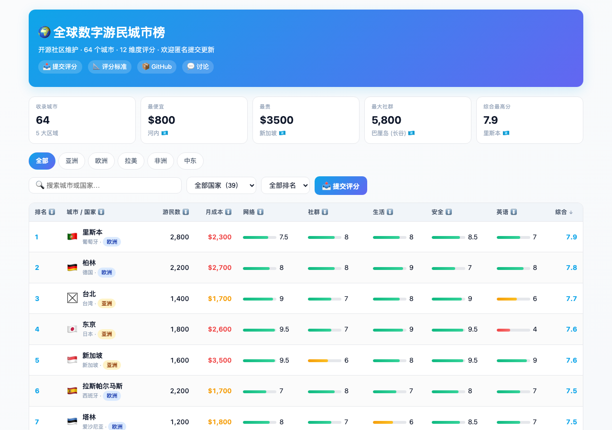

<a id="top"></a>
# 🌍 全球数字游民城市榜 / Global Digital Nomad Cities

> 全球数字游民城市排名 · 远程办公城市推荐 · 数字游民签证指南
>
> *Global Digital Nomad Cities ranking · Best cities for remote work · Digital nomad visa guide*

[](LICENSE)
[](CONTRIBUTING.md)
[](https://github.com/Roloria/global-digital-nomad/stargazers)
[](data/)
[](https://roloria.github.io/global-digital-nomad/)
[](https://roloria.github.io/global-digital-nomad/)

---

## 📌 项目简介

**全球数字游民计划** 致力于以**开放协作**的方式，整理并持续更新全球适合数字游民居住/工作的城市数据，包括成本、网络、生活品质、安全、签证等关键维度。

数据综合自：
- Nomad List（nomadlist.com）
- 各国数字游民签证政策与官方旅游局数据
- Airbnb / Numbeo / CoWorker 等公开统计
- 实地调研与社区贡献

**覆盖范围**：5 大区域 · 40 国/地区 · 80 个主流数字游民城市（含中国大陆 16 城） + **全球 60 个数字游民社区**

---

## 🌐 在线网站

<div align="center">

### 👉 https://roloria.github.io/global-digital-nomad/

</div>

> 一个完全可交互的网页应用，无需登录、移动端友好。

**核心功能**：

| 功能 | 说明 |
|---|---|
| 🔍 **多维筛选** | 按区域（5 大区）/ 国家（40 国）/ 排名（TOP 10/20/30/50/全部）/ 关键词搜索 |
| 📊 **可视化榜单** | 表格 + 评分条形图，点击行展开 12 维度完整详情 |
| 📤 **匿名提交** | 浏览器本地保存评分，附 GitHub Issue 模板一键上报 |
| 📐 **评分标准内置** | 页面底部完整展示 12 项评分口径与综合分计算公式 |
| 📱 **响应式** | 适配桌面 / 平板 / 手机（375px 起） |
| 🌙 **暗色模式** | 自动跟随系统主题 |
| 🌐 **数字游民社区** | 60 个联合办公 / 联合生活 / 度假村 / 聚会 / 在线社群的结构化资料；可筛选；支持**匿名提交**社区体验 → Cloudflare Worker → GitHub Issue（无需登录） |

**快速体验**：[打开网站](https://roloria.github.io/global-digital-nomad/) · [数据 CSV](data/digital-nomad-cities.csv) · [可视化报告](reports/digital-nomad-cities-report.md)


## 📸 网站截图

| 桌面端 | 移动端 |
|---|---|
|  |  |

> 截图说明：左侧为桌面端完整布局；右侧为 iPhone 14 尺寸下的自适应布局。

## 📂 仓库结构

```
global-digital-nomad/
├── README.md                        ← 本文件（项目说明）
├── CONTRIBUTING.md                  ← 如何贡献
├── CODE_OF_CONDUCT.md               ← 社区守则
├── LICENSE                          ← MIT 协议
│
├── data/                            ← 原始数据集
│   ├── digital-nomad-cities.xlsx    ← 主数据集（Excel）
│   ├── digital-nomad-cities.csv     ← 主数据集（CSV · 推荐用于 PR）
│   ├── digital-nomad-cities-china.csv ← 中国境内补充数据（16 城）
│   ├── digital-nomad-communities.csv ← 🌐 数字游民社区数据集（60 个 · 推荐用于 PR）
│   ├── digital-nomad-communities.xlsx ← 数字游民社区 Excel 多 sheet 版
│   └── README.md                    ← 数据字典与字段说明
│
├── reports/                         ← 调研报告
│   ├── digital-nomad-cities-report.md
│   ├── digital-nomad-cities-china-report.md ← 中国境内专项
│   └── digital-nomad-communities-report.md ← 🌐 数字游民社区报告
│
├── visualizations/                  ← 可视化页面
│   ├── digital-nomad-cities.html              ← 内嵌片段
│   └── digital-nomad-cities-standalone.html   ← 独立页面（可直接打开）
│
├── api/                             ← 🌐 匿名提交服务端（Cloudflare Worker）
│   ├── src/index.js                         ← Worker 入口
│   ├── wrangler.toml                        ← 部署配置
│   ├── package.json
│   └── README.md                            ← 部署指南
│
├── docs/                            ← 方法论与数据来源
│   ├── methodology.md
│   └── data-sources.md
│
└── assets/                          ← 图片、Logo 等
```

---

## 🚀 快速开始

### 在线查看调研报告
👉 [`reports/digital-nomad-cities-report.md`](reports/digital-nomad-cities-report.md)

### 在线查看交互式可视化
下载 [`visualizations/digital-nomad-cities-standalone.html`](visualizations/digital-nomad-cities-standalone.html) 后在浏览器中打开。

### 使用数据
直接下载：
- `data/digital-nomad-cities.xlsx`（Excel 多 sheet 版）
- `data/digital-nomad-cities.csv`（纯数据，便于代码处理）
- `data/digital-nomad-cities-china.csv`（中国境内 16 城补充数据）
- `data/digital-nomad-communities.csv`（🌐 全球 60 个数字游民社区：联合办公 / 联合生活 / 度假村 / 聚会 / 在线社群）
- `reports/digital-nomad-cities-china-report.md`（中国境内专项报告）
- `reports/digital-nomad-communities-report.md`（🌐 数字游民社区报告）

---

## 📊 核心数据维度

每个城市包含以下字段（详见 [data/README.md](data/README.md)）：

| 维度 | 说明 | 单位 |
|---|---|---|
| 排名 / 区域 / 城市 / 国家 | 基础信息 | — |
| 游民数 | 常驻/旅居的估算人数 | 人 |
| 月成本 | 单人月支出中位数 | USD |
| 网络 / 社群 / 生活 / 安全 | 0–10 分（10 最佳）| 分 |
| 英语 / 步行 / 空气 / 女性友好 / LGBTQ+ / 夜生活 / 安静度 / 种族包容 | 0–10 分 | 分 |
| 年均气温 / 最佳季节 / 签证 | 补充信息 | — |
| 综合分 | 加权平均 | 分 |

---

<a id="keywords"></a>
## 🔍 你可能也在找 · Related Searches

如果你通过搜索引擎来到这里,下面这些长尾关键词大概率也是你想问的,直接点进去看:

**排名 / Ranking**
- [数字游民城市排名 TOP 10 是哪些?](#-常见问题) · [哪些城市适合远程办公?](https://roloria.github.io/global-digital-nomad/#about) · [全球最适合数字游民居住的城市](https://roloria.github.io/global-digital-nomad/)
- [2026 数字游民城市榜单](https://roloria.github.io/global-digital-nomad/) · [Nomad List 中文版](https://roloria.github.io/global-digital-nomad/)

**签证 / Visa**
- [数字游民签证怎么申请?](#-常见问题) · [葡萄牙 D7 D8 签证要求](https://roloria.github.io/global-digital-nomad/) · [西班牙数字游民签证条件](https://roloria.github.io/global-digital-nomad/)
- [爱沙尼亚数字游民签证](https://roloria.github.io/global-digital-nomad/) · [捷克游民签证](https://roloria.github.io/global-digital-nomad/) · [日本经营管理签证](https://roloria.github.io/global-digital-nomad/)
- [哪些国家有数字游民签证?](https://roloria.github.io/global-digital-nomad/) · [游民签证收入门槛](https://roloria.github.io/global-digital-nomad/)

**预算 / Budget**
- [月成本最低的数字游民城市](#-常见问题) · [性价比最高的远程工作城市](https://roloria.github.io/global-digital-nomad/) · [1000 美元以内月生活的城市](https://roloria.github.io/global-digital-nomad/)
- [东南亚数字游民城市](https://roloria.github.io/global-digital-nomad/) · [拉丁美洲数字游民城市](https://roloria.github.io/global-digital-nomad/)

**安全 / 生活质量**
- [最安全的数字游民城市](https://roloria.github.io/global-digital-nomad/) · [女性友好城市排名](https://roloria.github.io/global-digital-nomad/) · [LGBTQ+ 友好城市](https://roloria.github.io/global-digital-nomad/)
- [英语友好的非英语国家](https://roloria.github.io/global-digital-nomad/) · [适合长期定居的数字游民城市](https://roloria.github.io/global-digital-nomad/)

**工具 / Tools**
- [城市评分标准说明](https://roloria.github.io/global-digital-nomad/#methodology) · [数据来源与采集方法](https://github.com/Roloria/global-digital-nomad/blob/main/docs/data-sources.md) · [数据更新频率](https://roloria.github.io/global-digital-nomad/#about)
- [下载完整 CSV 数据集](https://github.com/Roloria/global-digital-nomad/blob/main/data/digital-nomad-cities.csv) · [可视化报告](https://github.com/Roloria/global-digital-nomad/blob/main/reports/digital-nomad-cities-report.md)

---

## ❓ 常见问题

**Q: 什么是数字游民城市排名?**
A: 本榜单从月成本、网络、社群、生活、安全、英语、步行、空气、女性友好、LGBTQ+、夜生活、安静指数、种族包容共 12 个维度,对全球 80 个城市加权评分,综合分越高越适合长期数字游民生活。

**Q: 排名前十的数字游民城市有哪些?**
A: 里斯本、柏林、台北、东京、新加坡、拉斯帕尔马斯、塔林、布拉格、波尔图、巴塞罗那。完整榜单见[在线网站](https://roloria.github.io/global-digital-nomad/)。

**Q: 数字游民最便宜的城市是哪个?**
A: 清迈(泰国)、胡志明(越南)、金边(柬埔寨)、暹粒(柬埔寨)等东南亚城市月生活成本约 800-1100 美元,性价比较高。

**Q: 如何申请数字游民签证?**
A: 葡萄牙 D7/D8、西班牙数字游民签证、爱沙尼亚数字游民签证、捷克游民签证是较热门选项。每个城市行末的「签证」字段会标注推荐签证类型,具体申请请以当地移民局官网为准。

**Q: 数据多久更新一次?**
A: 开源社区维护,无强制更新周期。任何人都可以匿名提交更新,PR 合并后该城市「最后更新」字段会自动刷新。

---

## 🤝 参与共建

**我们欢迎任何形式的贡献**：
- 🐛 修正数据错误
- ➕ 添加新城市
- 📊 更新评分（基于最新调研）
- 🛂 更新签证政策
- 🌍 添加新维度（税收、医疗、CoWorking 价格…）
- 🌐 **新增数字游民社区**（编辑 `data/digital-nomad-communities.csv` · 18 字段）
- ✍️ **匿名分享社区体验**（站内「📤 分享社区体验」按钮 → POST 到 `api/` 服务 → 自动创建 GitHub Issue · **无需登录**）
- 📝 改进报告与可视化
- 🌐 多语言翻译

详见 [CONTRIBUTING.md](CONTRIBUTING.md)。

---

## 📅 更新日志

- **2026-08**：🌐 **新增数字游民社区板块**：60 个全球热门社区结构化数据（位置 / 介绍 / 政策 / 联系方式 / 综合分），覆盖 6 大区域 + 5 类社区（联合办公 45 / 联合生活 9 / 度假村 3 / 在线 2 / 聚会 1）。站内 `docs/index.html` 新增「🌐 数字游民社区」section（卡片展示 + 搜索 / 区域 / 类型 / 排序 4 重筛选 · 「📤 分享社区体验(匿名)」modal 直接 POST 到 `api/` Cloudflare Worker → 自动创建 GitHub Issue · **用户无需登录 / 无需本地存储**）。配套数据 `data/digital-nomad-communities.csv` + `.xlsx`、报告 `reports/digital-nomad-communities-report.md`、独立校验脚本 `.github/scripts/validate_communities.py`、GitHub Actions 新增 `validate-communities` job、`api/` 服务端代理（用户匿名 → 服务端 PAT → GitHub Issue）。
- **2026-08**：新增中国大陆 16 城数据并合并入主榜单（全球 80 城 / 40 国），新增中国专项数据表 `data/digital-nomad-cities-china.csv` 与报告 `reports/digital-nomad-cities-china-report.md`。
- **2026-08**：网站新增「关于 / 数据更新频率」区块、底部数据状态改为动态统计、城市行加 `📅 最后更新` 徽章、新增 FAQ 可视化区块、为 SEO 补齐 Open Graph / Twitter Card / JSON-LD / sitemap / robots / favicon、SVG 结构化数据。
- **2026-07**：首版发布,覆盖 64 个城市 / 39 个国家(亚洲 21 / 欧洲 18 / 拉美 15 / 非洲 7 / 中东 3)

---

## ⚖️ 许可证

本项目采用 [MIT 许可证](LICENSE)。你可以自由使用、修改和分发数据，但请保留原始来源声明。

数据本身来自多个公开来源，使用时请遵守各来源的使用条款。

---

## 🙏 致谢

- [Nomad List](https://nomadlist.com) — Pieter Levels 的开源数字游民数据
- [Flatio](https://flatio.com) — 数字游民住宿数据
- 所有参与贡献的 [贡献者们](https://github.com/Roloria/global-digital-nomad/graphs/contributors) ❤️

---

## 📬 联系方式

- 提交 Issue：[Issues](https://github.com/Roloria/global-digital-nomad/issues)
- 发起讨论：[Discussions](https://github.com/Roloria/global-digital-nomad/discussions)
- 维护者：[@Roloria](https://github.com/Roloria)

> 🌟 **如果这个项目对你有帮助，欢迎 Star、Fork、Watch，也欢迎推荐给身边正在考虑数字游民生活方式的朋友！**
